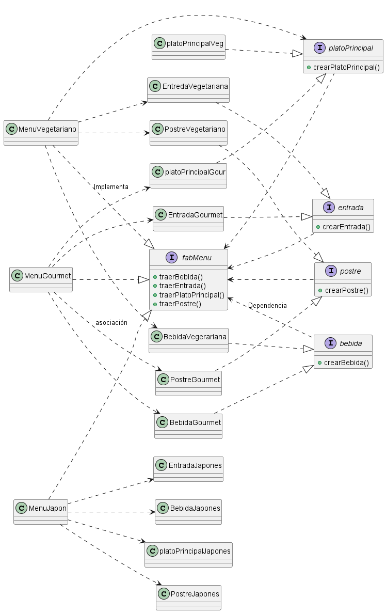

# Menú de restaurante usando "Abstract Factory"

### Juan Sebastian Diaz Peña - 20232020071

>Lenguaje: Java

__Diagrama UML:__

<!--  -->

* __Enunciado__: 
Un reconocido restaurante, ofrece distintos tipos de menús para adaptarse a diversos gustos y necesidades: Menú Vegetariano, Menú Gourmet y Menú Saludable. Cada menú está compuesto por una combinación coherente de productos: Entrada, Plato principal, Bebida y Postre.

    El equipo de TI del restaurante quiere desarrollar un sistema para:

    Generar menús completos de forma automatizada, asegurando que cada componente (entrada, plato principal, bebida y postre) pertenezca al mismo tipo de menú (por ejemplo, todo “Vegetariano”, todo “Gourmet” o todo “Saludable”).

    Facilitar la incorporación de nuevos menús sin reescribir la lógica central del sistema (por ejemplo, si en el futuro se quisiera añadir un “Menú Vegano” o un “Menú Infantil”).

    Mantener la coherencia en la composición de los menús. Es decir, que un plato principal “Gourmet” no se mezcle por error con un postre “Vegetariano”.

    El usuario decidira que elementos del menu va a ir consumiendo.

>[!important]
Calificación:
__Diagrama UML de la solución. (3 PUNTOS)__
__Código Java aplicación del patrón (GitHub). (2 PUNTOS)__
>